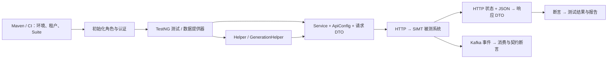

我会先结合项目文档和 Git 分支、提交记录，确认项目整体职责及你完成的三项工作的范围，再梳理架构、数据流和面试中可能被追问的具体问题。

Ran terminal command: git log --all --decorate --oneline -65

Read , lines 1 to 240

Read skill `analyzing-architecture`, lines 1 to 220

Read memory 

目前可以确认：这是面向 SIMT 业务系统的自动化测试工程，不是 SIMT 后端本身；你的工作集中在测试覆盖分析和代码治理。Git 中也找到了模型重构、死代码清理的独立分支，接下来会核对脚本实现，避免把“静态识别到调用”误说成“测试运行通过”。

Ran terminal command: git branch -a

Ran terminal command: git log --all --no-merges --oneline --regexp-ignore-case --grep='coverage\|dead.code\|bruteforce\|model.refactor' -65

Searched for files matching `**/{*coverage*,*audit*,*dead*,*BruteForce*,*instructions*,AGENTS.md}`, 5 matches

Read , lines 1 to 230

Read 

文档与构建配置表明，项目同时包含 API、UI、业务 E2E 和 Kafka 消息验证。下面重点追踪两条链路：测试请求如何进入业务系统，以及你的分析工具如何从代码、接口契约生成治理结果。

Ran terminal command: git branch --list --format='%(refname:short) %(objectname:short) %(HEAD)'

Ran terminal command: git show --stat db5900fdd e8fdcf6ec 70f9dd213 4fefc23d6 142626f91 0a670afce ca0d7be79 c2df0d26f 3f6b95c28

Read 

Searched for files matching `**/{BaseService,AuthManager,ApiBaseTest,SipService,SipGenerationHelper,*MessagesTests}.java`, 14 matches

Read 

有一个重要的版本差异：当前检出的是 `chore/coverage-check-fy27q1`，死代码审计和模型重构在其他分支。我会直接读取那些分支的文件与差异，不切分支、不改动工作区；后面也会区分初版覆盖率工具与后续增强版。

Ran terminal command: git show cleanup/code-cleanup:scripts/dead_code_audit.py

Ran terminal command: git ls-tree -r --name-only feature/refactor-model-clean -- scripts .github project-base/src/main/java/com/wiley/ct/util/apicoverage project-base/src/test .cursor/Models_Dedup_Execution_Report.md

Read 

Read 

Read , lines 1 to 230

源码显示，测试层通过 Service 封装 HTTP，通过 Helper 组织业务步骤；认证缓存虽然支持过期检查，但持有旧 Token 的 Service 并不会因此自动刷新。这个细节，以及“模型能编译是否代表 JSON 契约没变”，都是面试中值得准备的追问点。

Ran terminal command: git ls-tree -r --name-only feat/api-coverage-pr -- project-base/src/main/java/com/wiley/ct/util project-base/src/test .github/workflows scripts/api

Ran terminal command: git show cleanup/code-cleanup:.github/workflows/dead-code-audit.yml

Ran terminal command: git show feature/refactor-model-clean:.cursor/Models_Dedup_Execution_Report.md

Searched for regex `createSip|createSIP|TypeRef|requestSpecification|authorization|given\(` (`**/project-base/src/main/java/com/wiley/ct/services/simt/sip/SipService.java`), 126 results

Read , lines 1 to 270

模型重构记录体现了一个可讲清楚的取舍：合并真正兼容的 DTO，保留字段类型或业务语义不同的模型。报告里写的是建议验证项，并非已通过的运行结果，因此我不会把它当成完整回归成功的证据。

Ran terminal command: git log --all --author=yanchen --no-merges --format='%h %ad %s' --date=short -65

Ran terminal command: git ls-tree -r --name-only 4fefc23d6 -- project-base/src/main/java/com/wiley/ct/util/apicoverage project-base/src/test .github/workflows

Read , lines 1 to 210

Read 

Read skill `python-fact-grounded-coding`

你的三项工作可以串成一条清晰主线：发现接口覆盖缺口、识别无效代码、收敛重复模型。正在补齐两个关键技术点：API 匹配怎样处理路径差异，死代码审计怎样处理同名方法、重载和无法静态确定的调用。

Ran terminal command: git show cleanup/code-cleanup:scripts/dead_code_audit.py | Select-Object -First 205
Completed with input: git show cleanup/code-cleanup:scripts/dead_code_audit.py | Select-Object -First 205

Ran terminal command: git show cleanup/code-cleanup:scripts/dead_code_audit.py | Select-Object -Last 140

Ran terminal command: git show 4fefc23d6:project-base/src/main/java/com/wiley/ct/util/apicoverage/OperationMatcher.java

Ran terminal command: git show --stat d2539b65f 13624f4d2 53af66caf c88744d54

Read 

发现 API 覆盖分析有两条实现路线：早期 JavaParser 版本尝试关联测试调用链，后来的 Lite 版本明确只做 OpenAPI 与 Endpoint 常量映射。这两种口径不能混用；面试时讲清楚为什么简化分析目标，比报一个含义模糊的“覆盖率”更有说服力。

Ran terminal command: git show feature/add-api-scripts:scripts/api_coverage/javaparser-analyzer/src/main/java/com/wiley/qe/apicoverage/ApiCoverageJavaParserApp.java | Select-Object -First 235
Completed with input: git show feature/add-api-scripts:scripts/api_coverage/javaparser-analyzer/src/main/java/com/wiley/qe/apicoverage/ApiCoverageJavaParserApp.java | Select-Object -First 235

Ran terminal command: git show feature/add-api-scripts:scripts/api_coverage/analyze_api_coverage.py | Select-Object -First 125
Completed with input: git show feature/add-api-scripts:scripts/api_coverage/analyze_api_coverage.py | Select-Object -First 125

Ran terminal command: git show c88744d54 -- project-base/src/main/java/com/wiley/ct/util/apicoverage/OperationMatcher.java

Searched for regex `generateSubmittedSip|generate.*USIP|screen|revision|accept|create` (`**/project-base/src/main/java/com/wiley/ct/commons/SipGenerationHelper.java`), 121 results

Read 

分析范围已经收敛。最后会核对一个真实业务流程和覆盖率扫描的实现细节，然后按“项目定位 → 分层架构 → 数据流 → 三项贡献 → 面试问答”整理，并明确哪些结果已被提交记录证明、哪些仍需运行验证。

Ran terminal command: git show 4fefc23d6:project-base/src/main/java/com/wiley/ct/util/apicoverage/EndpointConstantScanner.java

Ran terminal command: git show 4fefc23d6:project-base/src/main/java/com/wiley/ct/util/apicoverage/CoverageReportBuilder.java | Select-String -Pattern 'strict|effective|confirmed|unmatched|count|total' -Context 2,2

Searched for regex `<artifactId>|<scope>` (`**/project-base/pom.xml`), 15 results

Read , lines 75 to 200

Read , lines 1 to 165

**先给结论：这个项目是 SIMT 业务系统的自动化质量保障工程；你完成的三项工作，可以归纳为“基于静态分析的测试资产治理”：识别接口覆盖缺口、审计无效代码、收敛重复模型。** 这比“写了几个辅助脚本”更准确，也更能体现工程价值。

以下依据项目 Wiki、源码，以及 `feature/add-api-scripts`、`feat/api-coverage-pr`、`cleanup/code-cleanup`、`feature/refactor-model-clean` 等分支的提交整理。没有切换分支、修改代码或运行业务测试；历史实现与当前工作区存在版本差异。

**一、项目定位**
SIMT 管理期刊的 **Special Issue，特刊，简称 SI**，以及 **Special Issue Proposal，特刊提案，简称 SIP**。业务涉及提案创建、资料完善、筛选审核、修改、决策，以及特刊后续管理；不同租户、用户角色和提案类型具有不同权限与流程。具体业务范围见 `api-tests-knowledge-wiki.md:60`。

这个仓库不是承载上述业务的后端服务，而是从外部验证它的测试客户端。它主要回答三类问题：
- **功能是否正确：** 接口能否正确创建、查询、修改业务对象，错误输入与无权限操作是否得到预期响应。
- **流程是否正确：** 多角色、多接口连续操作后，提案或特刊是否进入正确状态，关联数据是否一致。
- **集成是否正确：** UI、REST API、Kafka 事件、导出文件等不同输出是否符合预期；Allure、TestRail 等用于承载测试结果。

所以，不能把它描述为“我开发了一个特刊管理微服务系统”。更准确的是：**“我参与维护该系统的自动化测试工程，并负责覆盖分析与代码治理工具。”**

**二、架构设计**
这是一个 **Maven 多模块、分层封装、多种验证通道并存** 的架构，不是测试项目内部又部署了一套业务微服务。`pom.xml:17`配置 Java 11，项目使用 TestNG、Rest Assured、Selenium、Jackson 等技术。

| 层次 | 主要组成 | 职责与设计价值 |
|---|---|---|
| 执行层 | Maven、TestNG Suite、CI | 选择环境、租户、用例集合，组织执行与报告 |
| 场景层 | `project-tests` 中 API、UI、E2E、Kafka 测试 | 表达场景、角色、步骤和预期结果 |
| 业务编排层 | `Helper`、`GenerationHelper` | 复用跨接口流程，把测试数据准备到指定业务状态 |
| 接口访问层 | `Service`、`BaseService` | 将业务方法转换为 HTTP 请求，封装认证与响应类型 |
| 契约与模型层 | `ApiConfig`、`Endpoint`、请求与响应 DTO | 集中定义路径、HTTP 方法及 JSON 数据结构 |
| 基础设施层 | HTTP 工具、认证、配置、Kafka、断言与监听器 | 提供可复用的技术能力；UI 另有 Page、Block、Control 分层 |

这里最值得理解的是 **Service 与 Helper 的边界**：Service 回答“如何调用这个接口”，Helper 回答“怎样组合接口完成一个业务操作”；GenerationHelper 则回答“怎样得到一个已经处于指定状态的测试对象”。它们不是严格意义上的纯函数，一些数据准备操作会真实修改测试环境。

例如，`BaseService.java:25`统一构造服务地址、JSON Content-Type 和认证头；[HTTP 工具](project-base/src/main/java/com/wiley/ct/util/RestAssuredUtils.java#L109)负责请求发送、HTTP 状态和响应反序列化。DTO 是接口数据模型，**不能据此推断后端数据库表结构或事务实现**。

**三、完整数据流**
主测试链路可以概括为：

1. **配置与认证：** 测试启动后，根据租户选择角色账号。`ApiBaseTest.java:80`在 Suite 初始化阶段登录，保存用户 ID、Token 等信息；Service 再使用对应角色身份调用接口。
2. **准备业务数据：** 不是简单生成随机字符串。[真实 SSIP 准备流程](project-base/src/main/java/com/wiley/ct/commons/SipGenerationHelper.java#L78)会创建提案、取得版本号、添加主客座编辑、补充必填信息、设置征稿方式、取得邮件模板，再提交提案；继续准备审核场景时，会切换 OPS、Screener 等角色推进状态。
3. **请求与响应：** 业务编号、版本号、Token、请求 DTO 进入 Service；路径参数、查询参数和 JSON Body 组成 HTTP 请求；返回数据通过 Jackson、`TypeReference<T>` 转成类型化对象。**上一步返回的 ID、版本、模板会成为下一步输入**，这就是 E2E 的关键依赖链。
4. **异步验证：** `GenericSiLaunchedE2EMessagesTests.java:49`尝试先启动消费线程，再通过 API 触发业务变化，按业务编号、事件类型筛选消息，验证 Header、Payload Schema 和业务状态。不能把这种“API 触发端”误说成测试代码直接实现了后端生产者。
5. **收尾与结果：** 用例执行断言，生命周期方法处理日志、部分清理与退出登录，报告展示结果。不能假定所有数据都会自动回滚，也不能假定 HTTP 200 就代表业务正确。

**四、你的贡献**
**API Coverage：把接口契约与测试代码之间的关系显式化。** 提交 `d2539b65f`、`13624f4d2`包含早期 Python 分析器和 JavaParser 分析器：前者使用轻量扫描，后者通过 AST、符号解析及回退逻辑，关联 `OpenAPI → ApiConfig 常量 → Service 方法 → 指定范围内的测试调用`，区分未封装、已封装未使用、已有测试调用证据等状态。它们是不同实现，不能说 Python 必然只是 Java 的启动器。

后续 `70f9dd213`引入 Lite 版本，将目标收敛为 **OpenAPI Operation 与 Endpoint 常量映射**。数据流是“契约或 Excel 基线 → 排除规则 → 扫描 Endpoint → 路径匹配 → 人工确认叠加 → JSON/Excel 报告”。读取到的后续模块化版本使用 AST 优先、解析失败时正则回退；路径匹配包含 `METHOD + PATH`、参数模板归一化、版本及服务前缀候选。详见 Lite 说明。

这项工作最重要的是指标口径：令 $N$ 为纳入统计的接口数，$M$ 为映射成功数，$U$ 为**尚未映射、但人工确认已测试**的接口数，则严格映射率为 $M/N$，治理调整率为 $(M+U)/N$，有效缺口为 $N-M-U$。排除项改变分母；人工确认不改变严格映射率，而且不能重复计数。**两种静态分析都不证明测试实际执行或通过，Lite 更不证明存在测试调用。** `4fefc23d6`还记录了基线读取 fail-fast 与测试门禁修复。

**Dead-Code Audit：提供带不确定性分级的审计与 PR 门禁。** `cleanup/code-cleanup`中的 `db5900fdd`引入审计器，`e8fdcf6ec`加入 GitHub Actions。审计对象主要是 `blocks/pages/services` 的类与方法，引用证据来自基础模块、测试模块及若干配置文件类型；不是整个仓库任意代码的完整可达性分析。

其流程是“全量或 PR 新增声明 → 类型与引用索引 → 接收者绑定、继承和参数个数分析 → `keep/review/unused` → 报告或门禁”。`b04b222d3`处理语句顺序与块作用域，`b74552c44`按参数个数区分重载，`3eb028a67`修正 PR 声明行定位。CI 对新增 `unused` 阻断，对不确定 `review` 警告；本地删除默认 dry-run，实际修改要求显式参数，且禁止在 PR 模式执行。**这是启发式审计工具，不是 Java 编译器，也不是“无人复核即可安全删除”的证明器。**

**Refactor Model：减少重复 DTO，同时维护调用链与 JSON 契约。** `142626f91`、`0a670afce`、`ca0d7be79`、`c2df0d26f`、`3f6b95c28`体现了删除未使用模型、统一 `JournalChoiceItemData`、合并 Subject/Config 模型、用泛型分页响应替代专用包装类，以及同步 Service、Helper、测试和 Wiki。实际取舍是：兼容模型合并，存在标量类型或业务语义差异的模型保留。历史报告的“295 个模型”只是当时快照，不能作为最终分支数量；其中建议执行的验证也不能冒充已通过的回归结果。

**五、面试追问**
下面这些问题与你的实际代码直接相关，建议优先准备，不要只背框架定义。
1. **“这个项目解决什么问题？你负责哪部分？”** 回答业务系统的质量保障目标，再明确你的边界是覆盖分析、死代码审计、模型治理。不要把整个测试框架或 SIMT 后端都说成个人设计。
2. **“为什么分 Service、Helper、GenerationHelper？”** 用“查询提案接口”和“生成已进入审核阶段的提案”对比：前者封装协议，后者组合状态迁移。追问点是 Helper 过大、隐藏副作用、失败返回 `null` 时如何定位准备阶段故障。
3. **“API 测试为什么不是单元测试？”** 这些用例访问真实服务，受网络、认证、共享环境和已有数据影响，通常属于接口或集成测试。单个接口场景与多步 E2E 的区别主要在验证范围，不是有没有使用 TestNG。
4. **“你说的覆盖率究竟覆盖什么？”** 必须区分常量映射、静态测试调用证据、运行时执行、有效断言四个层次。面试官给你一个已定义但从未调用的 Endpoint，Lite 仍可能判定映射成功，你应主动承认。
5. **“同一路径不同 HTTP 方法怎么算？多个常量对应同一接口呢？”** 以 `METHOD + PATH` 为 Operation 身份，不能只按 URL 去重；多个常量映射同一 Operation，接口覆盖计数只能算一次，同时保留多对多明细证据。
6. **“参数名不同、版本前缀不同怎么匹配？”** 参数模板可以归一化，但不能抹掉静态路径段、HTTP 方法等身份信息。候选补全是启发式规则，不证明版本等价；多个候选命中时应保留歧义，后续可增加匹配来源和人工复核。
7. **“为什么需要人工确认名单？是不是在美化覆盖率？”** 说明原始映射缺口一直保留，只有明确审核状态才影响治理指标，已映射项不重复加分。进一步应能说明确认依据、责任人、过期复查，以及默认契约文件集合对分母的影响。
8. **“用了 AST，就能准确识别所有调用吗？”** 不能。动态字符串、反射、工厂返回类型、符号求解失败和跨层间接调用都有边界；Lite 的 Endpoint 提取也只支持特定表达式。你应分别说明 AST 结构识别、符号解析和运行时可达性的区别。
9. **“为什么不用 IDE Find Usages，或者直接全文搜索？”** IDE 适合人工核查，脚本适合批量盘点、输出报告和 PR 门禁；纯文本搜索无法可靠区分不同类的同名方法。你的价值在批量治理与证据分级，不是宣称全面替代 IDE。
10. **“`A.save()` 和 `B.save()` 怎么区分？重载呢？”** 解释接收者类型绑定、局部变量与字段类型、继承、作用域和语句顺序；再解释按参数个数只能区分一部分重载。`save(String)` 与 `save(Integer)`参数个数相同，不能据此准确判定，应该进入复核。
11. **“没有引用就一定是死代码吗？互相调用的死代码能发现吗？”** 反射、注解入口、配置引用会造成静态漏检；两个不可达方法互相引用，也可能逃过引用计数。后者需要从真实入口做调用图可达性分析，这不是当前审计器已经完成的能力。
12. **“为什么 CI 只管新增声明？误报怎么办？”** 增量门禁避免历史债务一次性阻塞所有 PR；全量审计用于专项清理。解释 `review` 警告与 `unused` 阻断的差别，以及跳过标签需要审核；修改或删除引用导致旧声明变死，是增量策略的剩余盲区。
13. **“自动删除怎么保证安全？”** 讲 dry-run、显式 apply、作用范围限制、声明与注解边界、PR 模式禁写，再讲 IDE 复核、测试代码编译及相关回归。安全机制降低风险，但不能把启发式判断变成绝对安全。
14. **“两个 DTO 字段一样就该合并吗？”** 不一定，还要比较 JSON 字段名、类型、空值、默认值、序列化注解和业务演化方向。共享类型也可能增加跨域耦合，例如 SIP 引用 user 包模型；这是减少重复与保持领域边界的权衡。
15. **“模型重构编译通过，为什么还可能出错？”** Jackson 的映射与泛型反序列化在运行时发生；当前 HTTP 工具还忽略未知字段，所以结构变化可能静默漏数据。应补代表性 JSON 反序列化、序列化契约比较、泛型分页元素类型验证和相关接口回归；只执行 `compile` 不等于检查了全部测试源码。
16. **“有哪些你会优先改进的架构风险？”** 可谈长期持有 Token 的 Service、共享静态状态、并行测试数据冲突、异步消费就绪判定、HTTP 状态与业务码分别断言。特别是 `AuthManager.java:53`的过期检查在再次获取认证时触发，并不是所有已有 Service 自动刷新。
17. **“怎么证明工具有价值？你和 AI 分别做了什么？”** 用固定版本基线统计人工确认后的缺口、误报漏报、有效清理项和契约回归结果，不编造百分比；Git 中存在 Bot 与 AI 协作记录，应如实说明你负责的需求、口径、修正与验收，并能现场解释同名绑定、重载和路径匹配这些关键决策。

**推荐面试表述：** “我参与 Wiley SIMT 自动化测试项目，主要负责测试资产治理。我实现了接口契约与代码的静态覆盖分析，区分映射证据和人工确认口径；开发了支持接收者绑定、部分重载区分及 PR 增量门禁的死代码审计工具；并完成重复 DTO 收敛和调用链同步。核心难点不是扫描文件，而是在不完整静态信息下控制误报、保持指标可解释，并验证清理没有破坏接口契约。”