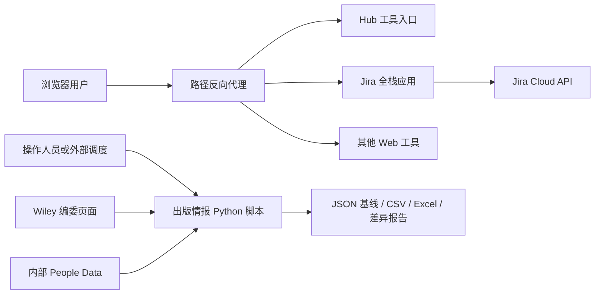

我会先看项目入口和你负责的两个工具，梳理它们的业务目标、架构和数据流，再结合实际实现整理面试追问，并区分“已经实现”和“可以改进”的部分。

Read 

Read skill `python-fact-grounded-coding`

Read skill `analyzing-architecture`

Read memory

从总入口看，这是一个内部质量工具集，统一门户只是入口，各工具保留独立运行边界。我接下来会核对 Jira 看板的在线查询链路，以及出版情报工具的离线处理链路，避免把它们误讲成同一种架构。

Searched for files matching `**/tools/jira-insights-dashboard/src/**`, 26 matches

Read 

Searched for files matching `**/{AGENTS.md,*.instructions.md}`, no matches

Read 

Read 

两个工具的定位已经比较清楚：Jira 工具把缺陷数据转成可交互的质量分析，出版情报工具则采集编委信息、维护历史基线，再与内部 People Data 对账。下面重点看指标计算、匹配规则和失败处理，这些比框架名称更容易成为面试追问。

Read 

Read 

Read 

Read 

Read 

Jira 的关键链路已确认：服务端分页读取 Jira API，转换成统一 DTO，浏览器再做筛选和统计；当前是按需刷新，不是推送式实时更新。也发现了值得准备的指标口径问题，比如“创建时间筛选”会影响解决趋势和积压量的含义。

Searched for regex `^def |^class |^import |^from |hash|retry|timeout|except|atomic|replace\(` (`**/tools/institutional-publication-intelligence/sync_editorial_board.py`), 98 results

Read , lines 1 to 460

Read 

Read 

Read 

出版情报部分的核心并不是“爬取后直接比较姓名”，而是先按期刊缩小候选范围，再按姓名规则打分，优先选择高分的一对一匹配。机构信息目前用于输出核对，没有参与匹配评分；因此匹配结果应表述为待验证的关联，而不是已经确认的人物身份。

Read , lines 220 to 442

Read , lines 1353 to 1608

Read , lines 1608 to 2028

Read 

Read 

差异检测也有一个重要边界：当前记录键包含角色，所以角色变化会表现为“旧记录删除、新记录增加”，不一定进入 `changed`。另外，页面哈希用于记录内容变化，但代码仍会解析页面，不能把它描述成“哈希未变就跳过解析”的优化。

Searched for files matching `**/tools/institutional-publication-intelligence/**`, 9 matches

Read 

Read 

Read 

Read , lines 1 to 180

主体已经梳理完了。我会用虚构姓名做几个不联网、不读取人员表的小验证，确认姓名匹配与角色变更的实际结果，再把面试问题整理成“为什么这样设计、有哪些局限、下一步怎么改”的答题结构。

Ran `pylanceRunCodeSnippet` 
Completed with input: {
  "workspaceRoot": "c:\\Users\\yanchen\\Desktop\\CTC-Quality-Tools",
  "workingDirectory": "c:\\Users\\yanchen\\Desktop\\CTC-Quality-Tools\\tools\\institutional-publication-intelligence",
  "codeSnippet": "import sys\nsys.dont_write_bytecode = True\nfrom dataclasses import replace\nimport compare_wiley_people as comparison\nimport sync_editorial_board as sync\ncases = [('Li Ming', 'Li Ming', 'Li', 'Ming'), ('Ming Li', 'Li Ming', 'Li', 'Ming'), ('M. Li', 'Ming Li', 'Ming', 'Li')]\nfor case in cases:\n    print('name_score', case[:2], comparison.name_match_score(*case))\nold = sync.EditorRecord('Synthetic Journal', 'TEST', 'Ming Li', 'Editor', 'Example University, China', 'Mainland China', 'https://example.org', '2026-01-01')\nfor label, current in [('role_change', replace(old, role='Associate Editor')), ('affiliation_change', replace(old, affiliation='Other University, China')), ('timestamp_only', replace(old, fetched_at='2026-10-09'))]:\n    result = sync.diff_records([old], [current])\n    print(label, {key: len(value) for key, value in result.items()})"
}

**先给结论：你负责的两个工具，可以统一讲成“把分散、异构的业务数据，转化为可解释、可追溯、可行动的信息”。** Jira 工具偏在线质量分析，出版情报工具偏离线数据采集、变更监控和跨系统对账。面试时，重点不是“做了图表、写了爬虫”，而是你如何解决数据接入、业务口径、数据质量和可靠性问题。

以下基于当前代码梳理；“建议改进”不代表已经实现。本次未访问真实 Jira 或重新采集网站，只对 Python 的姓名匹配、差异检测做了虚构数据验证。

**一、项目定位**
整个 CTC Quality Tools 是面向内部团队的工具集合：通过 Hub 统一发现和打开 Jira 分析、Kafka 排查、测试数据分析及浏览器插件，减少在多个系统之间切换、人工整理数据的工作。它不是一个所有模块共用数据库的大业务系统，而是**统一入口下、相对独立的工具集合**。
你负责的 **Jira Insights Dashboard**，回答的是：“当前缺陷有多少？积压是否增长？哪些优先级、环境、负责人需要重点关注？”核心价值是将 Jira 明细转为统一分析视图，辅助测试和研发定位质量风险，而不是代替 Jira 管理工单。
你负责的 **Institutional Publication Intelligence**，当前实现主要是：“公开期刊编委名单发生了什么变化？与内部 People Data 有哪些差异？”它提供数据核对线索，也为后续机构分析提供基础。不要把它描述成已经完成了论文分析、机构知识图谱或智能决策平台。
两个工具的共同思路是：**外部数据接入 → 标准化 → 业务规则 → 分析或差异结果 → 人工采取行动**。区别是前者面向交互查询，后者面向批处理和历史状态维护。

**二、整体架构**
仓库采用 **Monorepo**：JavaScript 项目由 npm workspaces 管理，共享 UI、Vite 配置等基础包；Python 工具与它们放在同一仓库，但不属于 npm 运行链路。共享的是工程组织与部分基础设施，不意味着所有工具采用相同技术栈。

网关代码按路径分流：`/` 指向 Hub，`/jira-insights/` 指向 Jira 应用，其他工具类似；默认本地入口为 `2900`。它主要负责转发，不计算业务指标。Jira 应用的 Vite `base` 与路由 `basepath` 配合子路径访问，避免资源和路由地址错位。
**架构定性：模块化、多进程的内部工具平台，不宜直接包装成微服务架构。** 当前 `Jenkinsfile`描述的是一个容器内启动多个 Web 进程、只映射网关端口的部署方式，并且使用开发服务器运行模式；代码不能证明已经具备独立扩缩容、服务治理或高可用。出版情报脚本也没有接入这条 Web 启动链路。

**三、Jira 的架构与数据流**
技术栈是 **React 19 + TypeScript + TanStack Start/Router + Recharts + date-fns**。TanStack Start 让页面和服务端函数处于同一个项目，因此这是全栈应用，不是浏览器直接携带 Token 请求 Jira，也不需要另外维护一个 Express 后端。
**分层：** 页面层管理查询、筛选和展示；服务端函数承接调用、统一返回错误；Jira 客户端负责认证、分页、字段适配；分析层负责筛选、趋势、分组及账龄计算。
**首次加载：** 浏览器访问页面 → 路由 loader 调用 `loadJiraBugs` → 服务端读取环境变量中的账号、Token 和 JQL → 查询自定义环境字段 ID → 调用 Jira `/rest/api/3/search/jql` → 每页最多请求 100 条，沿 `nextPageToken` 继续读取 → 合并所有页。
**数据标准化：** Jira 原始 Issue → `BugDTO`，提取负责人、状态、时间、标签等字段，将 ADF 描述转成文本，统一环境字段的多种返回形式 → 页面将日期字符串转成 `Date` → 交给分析函数。DTO 的价值是隔离上游复杂结构，让图表不必理解 Jira 原始接口。
**页面交互：** 日期、优先级、状态、Resolution 筛选在已加载数据上本地执行；修改并应用 JQL 或点击 Refresh 才重新请求服务器，成功返回后重置筛选。`useMemo`用于部分派生数据，**不是服务端结果缓存**。当前只有环境字段 ID 的进程内缓存，没有看到 Jira 查询结果持久化。
**输出：** 总量、Open、Resolved、平均未解决时长、近七天解决量；新增/解决/积压趋势；负责人、报告人、环境和标签分布；最近 25 条明细及详情抽屉。周趋势采用周三到周二分桶。这些是“按需更新的分析”，不是 WebSocket 推送式实时系统。

**四、出版情报的数据流**
它是一个**文件驱动的离线数据流水线**。核心实体 `EditorRecord` 包含期刊、期刊代码、姓名、角色、机构、地区、来源 URL 和采集时间；其中来源与时间支撑结果追溯。主要实现见 采集同步脚本。
**采集与抽取：** 期刊注册表 → 逐期刊请求编委页面，或读取本地 HTML → 清理干扰内容、定位编委区域 → 使用角色分块、表格、标题、段落等多种规则抽取姓名/机构/角色 → 合并去重。网络层优先使用 curl，有超时、重试和退避，并在相应条件下回退 urllib；不是浏览器渲染方案。
**地区判断：** 先排除港澳台，再综合国家、城市、组织及大学名称线索判断是否属于业务定义的 Mainland China 范围。它识别的是**机构所在地线索，不是个人国籍**；混合机构、缺失地址和名称歧义仍需要人工复核。
**历史变更：** 当前记录与上次该期刊的 JSON 基线比较，得到新增、删除、字段变化 → 更新基线、内容哈希，按配置保存 HTML 快照，并在需要时写变更日志 → 从全部期刊基线重建总 CSV。因此只更新一个期刊，也不会直接把总表缩成这一个期刊的数据。
**跨系统对账：** 比较脚本读取采集 CSV 和内部 Excel 的 `Export` 表 → 分别按地区、`Country=CHINA`筛选 → 按 Journal Group Code 分组 → 组内姓名标准化和评分 → 高分优先的一对一贪心匹配 → 输出 Matched、Only Wiley、Only People 及汇总报告。缺少期刊代码时退回标题分组，但这不能自动解决所有代码缺失问题。
**姓名规则：** 处理大小写、重音、空格、连字符、姓名顺序、首字母及有限拼写差异。实际小样本验证中，完全一致为 100 分，顺序变化为 95 分，首字母形式为 85 分。**这些是规则分数，不是身份正确概率**；机构、邮箱目前没有参与这个匹配评分。
**交付与边界：** 汇总脚本生成期刊、机构和对账工作表；机构汇总使用原始 People Data，并非全部限定为中国数据。链接补全脚本是辅助工具，不是主链路中的自动步骤。当前不存在自动回写 People Data 的闭环，两个 Only 集合是待核查队列，而非已判定的数据错误。

**五、面试官会怎么问**
下面的问题建议按“业务问题 → 当前做法 → 选择原因 → 局限与改进”回答，不要只报技术名词。

1. **“为什么还要做一个看板，Jira 自带报表不够吗？”** 说明团队需要把指定 JQL 范围、业务周周期、多维拆解及明细下钻集中到一个入口，减少重复配置和整理。不要声称 Jira 完全做不到，而是解释定制工作流的收益，并准备真实使用反馈或节省时间的证据。
2. **“为什么用 TanStack Start，而不是前后端分离？”** 当前工具规模下，同项目的服务端函数能降低接口、部署和类型维护成本，同时保留凭据的服务端边界。代价是前后端耦合在同一应用生命周期中；如果未来多个客户端复用接口、负载不同，再考虑独立服务。
3. **“Token 放服务端就安全吗？谁都能执行自定义 JQL 吗？”** 不能把凭据不下发等同于访问控制完整。当前调用链没看到应用级用户鉴权或项目范围限制，访问者可能借配置账号的权限查询数据。应讨论上游访问控制是否存在，以及应用侧认证、最小权限账号、JQL 范围限制和请求限流。
4. **“怎样保证 Jira 数据取全？中途失败怎么办？”** 解释游标分页、终止条件和字段裁剪。当前任意页失败会进入统一错误结果，没有返回部分成功数据，也没有专门的 429 重试或显式请求超时。改进应包括遵守 `Retry-After`、有限退避、取消请求和总时限；跨页数据一致性也不能想当然。
5. **“你们的 Resolved 到底怎么算？”** 这是当前代码的具体风险：页面实际用“总数减已知 Open 状态数”，未知状态可能被算成 Resolved。应明确状态分类、Resolution 字段和解决时间是三个不同概念，建议使用 Jira 状态类别或可配置映射，并让所有图表复用统一口径。
6. **“选本周后，解决趋势是否包含上周创建、本周解决的 Bug？”** 当前先按创建时间过滤，再统计解决趋势，所以可能不包含。必须区分“本周创建这批缺陷的表现”和“本周发生的所有解决事件”；同样，当前积压曲线只覆盖查询和筛选内的记录，不能直接称为全项目历史积压。
7. **“为什么解决趋势不能用 updated？重开如何处理？”** `updated`会被任何修改刷新，`resolutiondate`更符合解决事件含义。但一个当前状态和一个解决时间仍不足以还原多次解决、重开的完整历史；准确历史积压需要 changelog 或周期快照。当前模型只能做有限重建。
8. **“还有哪些容易错的统计边界？”** 当前账龄的 `<1 day` 实际采用含 1 的区间，与 `1–3 days`在一天处重叠；这是值得补测试的明确问题。还应覆盖时区、跨周、空日期、未知状态，以及多环境/多标签导致分类计数之和超过缺陷总数的正常情况。
9. **“数据涨到十万条怎么办？”** 当前全量返回浏览器，趋势中的逐桶积压扫描约为 $O(NB)$，其中 $B$ 是时间桶数。可以用事件增减和前缀和优化趋势，再按需要引入服务端聚合、分页明细、查询缓存及后台同步；不能把已有 `useMemo`说成已经解决大数据量问题。
10. **“编委页面格式不统一，你怎么提高抽取可靠性？”** 解释先定位业务区域，再组合多种结构规则，并对重复结果择优。当前主要基于正则和字符串规则，低依赖但维护成本会随模板增长；后续可采用 DOM 解析和模板适配器，用代表性页面样本验证，不应承诺一个通用规则覆盖全部网站。
11. **“HTTP 成功但抽取错了，怎么发现？”** 当前“一个编委都没解析到”会报错，但解析到错误的人、或地区筛选后异常归零，仍可能更新基线。应增加总数骤降、机构缺失率、姓名合法性、模板变化等质量检查；异常结果先隔离复核，避免把解析退化当成真实人员离任。
12. **“网页哈希和记录 diff 为什么都要有？”** 哈希检测页面内容变化，记录 diff 解释业务变化，页面样式变化不一定意味着名单变化。当前即使哈希一致仍会解析，不是跳过解析的缓存。若以后增加跳过机制，还要把解析器和规则版本纳入判断，否则代码升级后无法重新解析旧页面。
13. **“你怎么定义同一条记录？角色变化算什么？”** 当前键包含期刊代码、规范化姓名、角色和地区。已验证：角色变化产生一增一删，机构变化进入 `changed`，仅采集时间变化不会触发业务 diff。因此当前跟踪更接近“编委任职记录”，不是具有稳定 ID 的人；不能承诺完整识别一个人的职业变化。
14. **“姓名为什么不直接模糊匹配？一对一为什么用贪心？”** 先按期刊分组减少跨期刊误配，再让精确匹配优先，避免低分缩写提前占用正确候选。贪心简单、可解释，但不保证全局最优，同分也缺少充分消歧；冲突较多时可以研究最大权重匹配，并设置拒绝匹配、人工复核规则。
15. **“70 分到底可靠吗？怎么证明匹配效果？”** 它不是 70% 正确率，代码里的字符串相似度也不能证明仅差一个字符。应人工标注样本、计算 Precision/Recall，特别覆盖重名、首字母、多任职和拼写变化。当前导出没有保留匹配分数，建议补充规则命中原因、分数与复核状态，而不是编造准确率。
16. **“为什么不能把 Only People 直接删除？”** 网站和内部系统的更新周期、人员范围可能不同，网络失败、旧基线、抽取遗漏也会造成差异。正确流程是检查采集状态和时间、打开来源核对、确认业务口径后再更新内部数据，不应自动把单边缺失判为过期人员。
17. **“一批期刊部分失败，最终数据是什么状态？”** 当前按期刊隔离异常、继续处理并记录失败；通常采集/解析失败会保留原有基线，总表可能混合本次新数据和旧数据。退出码 `0/1/2`分别表达无变更、有变更、失败。生产化应附带每期刊成功时间和本次状态，避免使用者误以为总表全部最新。
18. **“没有数据库，如何保证一致性和可恢复？”** 当前 JSON 保存基线，CSV/Excel 便于业务使用，适合单人或低频批处理；但不是事务系统。CSV 使用临时文件替换，JSON、哈希和日志并非整体原子提交，也没有并发锁。Excel 锁文件时还可能写到备用 CSV，而下游仍读固定路径；应改为显式传递产物路径或失败停止。
19. **“机构人数和任职数为什么要分开？隐私如何处理？”** 同一个人可能有多项期刊任职，不能直接把行数当人数。汇总脚本用邮箱优先、姓名兜底作为 Person Key，但机构仍主要按原始文本分组，尚未完成统一机构 ID 归并。此外对账导出含邮箱，源码、原始表、报告和 Cookie 应分别管理权限与保留周期。
20. **“你如何测试？最值得补的是什么？”** Jira 优先测指标纯函数、分页和接口失败；出版工具优先测多模板 HTML、地区规则、姓名冲突和基线差异，再增加少量端到端冒烟验证。当前 Python 交接文档明确没有自动化测试套件，所以应诚实说明现有验证方式，把回归测试集作为改进，而不是说已经有完整测试保障。

**六、面试表达**
可以这样开场：“我主要负责内部工具平台中的两个数据工具。Jira 看板通过服务端安全接入 Jira API，处理分页和字段标准化，再提供缺陷趋势、多维筛选与明细下钻；出版情报工具则将异构编委页面转成结构化记录，维护历史基线，并与内部 People Data 做期刊范围内的姓名匹配和差异输出。两个工具共同的重点，是把原始数据变成业务可核查、可使用的结果。”
随后挑一个你确实主导的难点展开，例如“统计口径为什么不能混用创建与解决时间”或“如何避免低分姓名匹配占用精确候选”。平台网关、部署等共享能力要明确团队与个人贡献边界；规模、耗时、准确率、节省工时也只使用你能提供依据的数据。
**最值得你准备扎实的三个主题：指标口径、实体匹配、失败情况下的数据可信度。** 这三点比堆叠框架名更能体现工程能力；当前这两个工具也不是 LLM/Agent 项目，规则评分不要包装成模型推理。