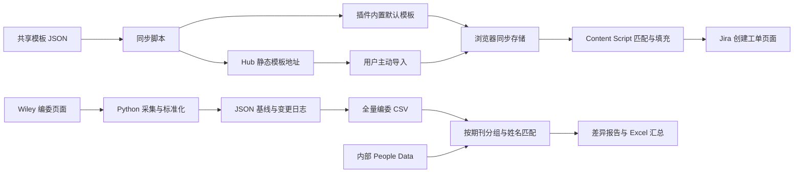

我会把 Jira 看板部分替换为 Jira 模板工具，先核对共享模板包与浏览器插件的关系，再重新梳理两个工具的业务目标、架构、数据流和面试追问。

Read 

Read 

Read 

Read memory 

Read 

这里要先区分贡献边界：`jira-templates` 是共享模板数据源，真正执行模板匹配和页面填充的是浏览器插件。我会把两者如何协作讲清楚，但不会默认把整个插件都算作你的个人实现。

Searched for regex `function |MutationObserver|storage|sendMessage|dispatchEvent|innerHTML|execCommand|score|priority` (`**/plugins/jira-template-extension/content.js`), 35 results

Searched for regex `function |sendMessage|fetch\(|JSON.parse|storage|merge` (`**/plugins/jira-template-extension/options/options.js`), 24 results

Read 

Read 

Read 

当前版本确认采用 Manifest V3 插件：后台初始化默认配置，Options 管理模板，Content Script 监听 Jira 创建窗口并填充描述。它不通过 Jira API 创建工单，用户仍在 Jira 页面里审核和提交；这是面试介绍时很重要的边界。

Read 

Read , lines 1 to 355

Read 

模板匹配和分发链路已确认：项目与类型同时匹配优先，其次是类型、项目、通用模板；团队模板通过静态 JSON 分发，导入时按 ID 合并，并非自动强制同步。我还发现当前代码与旧记录不一致，会以当前源码为准，特别说明输入覆盖、自定义域名和默认模板恢复的实际边界。

Ran terminal command: const fs=require('node:fs'); const root='c:/Users/yanchen/Desktop/CTC-Quality-Tools/'; const paths=['packages/jira-templates/templates.json','plugins/jira-template-extension/defaults/templates.json','tools/hub/frontend/public/shared/jira-templates.json']; const data=paths.map(p=>JSON.parse(fs.readFileSync(root+p,'utf8'))); console.log(JSON.stringify({templateCount:data[0].length,uniqueIds:new Set(data[0].map(t=>t.id)).size,basicFieldsValid:data[0].every(t=>typeof t.id==='string' && typeof t.name==='string' && typeof t.template==='string' && typeof t.enabled==='boolean'),extensionDefaultsMatch:JSON.stringify(data[0])===JSON.stringify(data[1]),hubFeedMatch:JSON.stringify(data[0])===JSON.stringify(data[2])},null,2));

只读校验通过：共享包中的 6 个模板 ID 唯一，且与插件默认文件、Hub 分发文件一致。下面按正确的两个工具重新组织说明；出版情报部分沿用已核对的源码事实，插件部分会区分设计目标、当前实现和可改进点。

Inserted into memory file 

这次按你更正后的范围重新梳理：**Jira Template 工具和 Institutional Publication Intelligence 工具，不再讨论 Jira 看板。** 先明确： packages/jira-templates是共享模板数据包，实际匹配和填充由浏览器插件执行。下面解释完整协作链路，但不会把关联模块全部默认算作你的个人贡献。

**一、宏观定位**
整个 CTC Quality Tools 是内部工具集：用统一门户连接质量分析、调试、模板和数据处理工具，减少重复操作与人工整理。它更接近**模块化的内部效率平台**，不是一个所有模块共享数据库、统一业务模型的大型系统。
**Jira Template 解决“输入质量”问题：** 不同人员创建工单时，容易遗漏复现步骤、预期结果、实际结果、环境或验收标准。工具将团队规范变成模板，按项目和工单类型自动填入描述，减少复制粘贴和信息补问。它辅助填写，不负责自动提交，也没有实现必填内容的强制校验。
**出版情报工具解决“数据一致性与变化发现”问题：** 从 Wiley 期刊编委页面提取人员、角色和机构信息，维护历史基线，再与内部 People Data 对比，帮助业务人员发现新增、离任或待核查记录。当前实现集中于编委数据，不应描述为完整的论文分析或机构知识图谱平台。
两者可以统一为一句话：**一个把业务规范落实到数据录入环节，另一个把外部非结构化信息转化为可追溯、可核查的数据结果。** 面试价值分别在配置分发与浏览器交互、异构数据抽取与实体匹配。

**二、整体架构**
仓库使用 Monorepo 管理多个工具。Jira 模板采用“共享配置包＋静态分发＋浏览器插件”，出版情报采用“Python 批处理＋文件存储＋报告输出”。**它们不是前后端关系，也没有看到彼此直接交换业务数据。**

Hub 及路径网关提供统一访问入口，但不参与插件运行时的模板匹配。插件已经拥有模板后，填充不需要实时访问 Hub；出版情报脚本也不是 Hub 后面的在线 API。当前部署配置体现的是内部工具的集中运行，不宜包装成已经具备独立扩缩容和服务治理的微服务体系。

**三、Jira 模板**
**配置模型：** 模板定义包含 `id、name、project、issuetype、template、enabled`。`id`用于导入合并，项目和类型用于选择规则，正文包含填写提示。目前有通用、Bug、Story、Task、Epic、Sub-task 六种默认模板；空项目或类型表示不限制该维度。
**配置分发：** 修改共享 JSON → 执行 同步脚本 → 复制到插件 `defaults` 和 Hub 静态目录。前者支持安装时初始化，后者提供团队模板下载地址。这是“一个维护源、两个分发副本”，不是插件运行时直接读取 npm 包，也不是发布一个公共 npm 依赖。
**插件分层：** Manifest声明 MV3 权限和注入范围；[后台 Service Worker](plugins/jira-template-extension/background.js)负责安装初始化、默认模板读取及消息处理；Options负责增删改、启停、导入导出；[Content Script](plugins/jira-template-extension/content.js)负责页面识别、匹配、填充和占位符导航。Popup 主要是状态和管理入口。
**运行数据流：** 安装时将内置模板写入 `chrome.storage.sync` → Jira 页面中的 Content Script 读取配置 → `MutationObserver`发现创建窗口及内部变化 → 读取项目、Issue Type → 选择模板 → 写入描述字段 → 定位 `<TI>…</TI>`提示内容 → 用户补充、审核并在 Jira 提交。整个路径不需要插件持有 Jira API Token。
**匹配策略：** “项目＋类型”优先，其次“仅类型”，再次“仅项目”，最后通用模板；禁用模板不参与。比较时进行大小写和空白处理，支持逗号分隔条件。相同优先级有多个匹配项时，当前取数组中第一个，因此**模板顺序实际上参与决策**。
**编辑器适配：** 对 `textarea`使用原生 value setter，并派发 `input/change`事件；对 ProseMirror/contenteditable 使用文本插入操作。原因是“DOM 看起来改变”不等于“页面应用状态已经接受输入”。但当前插入的是文本，不能保证 `h2.`等 Wiki 标记在现代编辑器中自动变为富文本标题。
**配置更新：** Options 保存后通过 `storage.onChanged`更新 Content Script 的内存配置；URL/文件导入按相同 ID 替换、新 ID 追加，没有 ID 则生成。浏览器同步存储服务于用户的浏览器同步环境，**不等于全团队自动同步**；团队成员需要主动导入，插件也没有自动订阅远程更新。
**当前边界：** 恢复默认会替换 `default-*`模板、保留其他模板，没有自动备份；修改模板配置不会保证当前打开的窗口立即重新填充。自定义域名虽可保存，但 Manifest 仍只对 `*.atlassian.net`自动注入，不能据此承诺任意自建 Jira 已完整支持。

**四、出版情报**
**核心模型：** 同步脚本使用 `EditorRecord`保存期刊、期刊代码、姓名、角色、机构、地区、来源 URL 和采集时间。来源与时间使每条结果能够追溯到采集依据，而不是仅留下一个无法解释的名单。
**采集与解析：** 从期刊注册表读取 URL → 逐期刊下载 HTML，或读取本地 HTML → 定位编委区域 → 按角色分块、表格、标题、段落等结构抽取 → 去重并择优保留机构信息。网络层有超时、重试和退避，优先 curl，并在相应条件下回退 urllib；当前不是基于浏览器渲染的采集框架。
**地区过滤：** 按业务统计范围先排除港澳台，再结合国家、城市、机构和大学名称规则识别 Mainland China。这里判断的是机构所在地线索，不是人物国籍；多地任职、地址缺失和机构别名仍有误判风险。
**历史监控：** 当前解析结果 → 与该期刊上次 JSON 基线比较 → 生成新增、删除、变化 → 更新基线、内容哈希，按配置保存快照及变更日志 → 从全部期刊基线重建总 CSV。因此只同步一个期刊时，总表仍包含其他期刊的历史基线。
**对账流程：** 比较脚本读取编委 CSV 与内部 Excel 的 `Export`表 → 筛选目标地区 → 按 Journal Group Code 分组 → 组内姓名标准化、候选评分 → 高分优先做一对一贪心匹配 → 输出 Matched、Only Wiley、Only People 和期刊汇总。
**姓名匹配：** 处理重音、空格、连字符、姓名顺序、首字母和有限拼写差异。规则分数表示相对优先级，不是正确概率；机构、邮箱当前没有参与匹配评分。先按期刊分组是重要的候选缩小策略，但仍不能彻底解决同刊同名、多角色任职或缩写歧义。
**结果交付：** 汇总脚本生成期刊、机构及对账工作表；机构汇总基于原始 People Data，不是全部限定为中国记录。当前没有自动修改内部人员库，两个 Only 集合应当视为复核队列，而不是直接判定为错误或过期的数据。
**状态边界：** 单期刊失败后继续处理其他期刊，总表可能混合新旧基线；退出码区分无变更、有变更和失败。页面哈希目前不用于跳过解析。记录键包含角色，因此角色变化通常表现为“一增一删”，机构变化才可能进入同一记录的 `changed`。

**五、面试追问**
建议按“业务问题 → 当前实现 → 取舍 → 局限 → 改进”回答。以下不是泛泛的八股题，而是针对当前代码很可能出现的追问。
1. **“为什么做插件，而不是直接配置 Jira？”** 可以回答：插件让模板靠近用户创建工单的动作，便于个人及团队分发，不需要本工具直接接管 Jira 服务端。但原生配置可能更稳定、治理能力更强，应结合你当时真实遇到的权限、需求和部署条件解释，不能编造“Jira 原生做不到”。
2. **“共享包里只是 JSON，你具体解决了什么工程问题？”** 重点讲模板结构、统一维护源、稳定 ID、默认规则、分发副本与兼容性。若插件也是你实现的，再展开运行链路；如果你只负责配置包，就明确说插件是消费方，不把 DOM 注入等实现归为个人工作。
3. **“为什么要有内置默认和远程模板两条分发路径？”** 内置默认保证首次安装即可使用，远程静态文件便于团队独立更新模板。代价是产生多个版本和副本，需要校验、版本标识和更新策略。当前同步脚本主要是复制文件，不包含完整的 Schema 校验或版本迁移。
4. **“为什么类型匹配优先于项目匹配？同级冲突怎么办？”** 这是业务规则：Bug 与 Story 所需信息通常差异更直接，但不应说这是普适最优。当前同级取首项，可考虑显式优先级、冲突提示及“命中了哪条规则”的解释，避免数组排序带来隐藏行为。
5. **“重复导入是否幂等？远程删除模板会同步删除吗？”** 固定且唯一的 ID 有利于重复导入覆盖同一条；缺少 ID 会生成新记录，重复 ID 输入也未被严格拒绝。当前是合并而非镜像，远程删除不会自动删除本地项。进一步可以设计来源、版本、删除标记，以及团队默认与个人覆盖的分层。
6. **“你怎么避免覆盖用户已经写好的内容？”** 当前 `lastInjectedId`主要防止连续重复填入同一模板，不等于草稿保护；切换到另一模板会替换内容。改进应追踪用户编辑状态，仅在空字段或仍等于上次注入内容时自动替换，否则确认、插入或提供撤销。
7. **“MutationObserver 能保证所有创建窗口都正确处理吗？”** 不能。已有窗口的首次扫描、编辑器延迟挂载、输入 value 变化未触发观察、窗口关闭后的延迟任务都是边界。当前还会在找不到描述字段前更新项目状态，后续相同状态可能不再重试；应使用明确的就绪状态、事件监听和可取消的重试。
8. **“为什么不能直接设置 innerHTML？占位符有什么难点？”** 富文本编辑器维护自己的状态，直接改 DOM 可能被覆盖或未进入提交值；HTML 注入还增加安全风险。当前快捷导航缓存字符位置，用户改字后位置会漂移，`innerText`与 DOM 文本节点换行也可能不一致，而且 `<TI>`标签没有自动清理，需重新计算或采用编辑器感知方案。
9. **“插件如何保证性能和安全？自定义域名真能工作吗？”** 当前全局观察 DOM、回调中安排延迟执行，延迟不等于真正防抖；应缩小观察范围、合并任务并清理定时器。域名配置也不等于获得注入权限。远程 JSON 应视为不可信输入，增加字段类型、ID、数量、长度与渲染转义检查；Options 的按钮隐藏不是权限控制。
10. **“为什么存 chrome.storage.sync，不存服务端？”** 它降低配置后端成本，也适合用户跨设备同步，但受配额、写入频率和同步冲突约束。当前整组模板保存在一个 key 下，大模板集需要评估容量；未来可拆分存储或用受控服务分发。MV3 Worker 会休眠，持久状态不能只依赖后台内存。
11. **“编委页面格式这么多，如何保证抽取正确？”** 当前组合多种解析规则并去重，比只写一个选择器覆盖面更大，但 HTML 成功下载不代表语义解析正确。应建立多模板样本集，核对姓名、角色、机构的对应关系；长期可引入 DOM 解析器和模板适配层，减少正则规则之间的干扰。
12. **“某次解析人数骤降，你会当成大量离任吗？”** 不应直接接受。当前无任何编委会报错，但错误抽取或地区过滤后归零仍可能污染基线。应增加人数变化阈值、机构缺失率、模板识别状态等质量门槛，异常快照隔离复核，确认后才发布新基线。
13. **“为什么既保存哈希又保存记录差异？”** 哈希回答内容是否变化，记录差异回答业务对象如何变化，两者语义不同。当前哈希并未跳过解析；如果以后用作缓存，必须考虑解析器与地区规则版本，否则规则升级后旧页面不会重新处理。
14. **“姓名评分可靠吗？为什么选择贪心而不是全局匹配？”** 高分优先可以避免缩写候选抢占精确对应项，实现简单且可解释，但不保证全局最优，也未充分处理同分歧义。可以考虑最大权重匹配、多字段证据和拒绝匹配机制；当前记录是一对一匹配，还要先澄清业务是在匹配“人”还是“任职关系”。
15. **“如何证明匹配准确？Only People 能直接删除吗？”** 应建立人工标注集，分别衡量 Precision、Recall，覆盖重名、缩写、换序和拼写差异；不能把规则分数当准确率。单边缺失也可能来自抓取失败、旧基线或系统范围差异，必须核查来源和更新时间。当前导出未保留匹配分数，补充命中规则和复核状态会提高可解释性。
16. **“为何不用数据库？失败、并发和文件锁怎么办？”** JSON/CSV/Excel适合低频批处理和业务核对，但缺少事务、并发控制及统一查询能力。当前 CSV 使用临时文件替换，JSON、哈希、日志并非整体原子提交；Excel 锁文件时可能输出备用文件而下游仍读旧路径。应显式传递产物路径、增加批次状态，规模扩大后再引入数据库。
17. **“人数和任职数怎么区分？如何处理敏感信息？”** 同一人跨期刊任职不能按行数当人数；当前汇总以邮箱优先、姓名兜底生成 Person Key，但不是稳定身份 ID，机构名称也尚未完全归一。内部表及导出包含邮箱等信息，需要将源码、原始数据、报告和 Cookie 分开管理权限与保留策略。
18. **“你怎么测试？项目效果如何量化？”** 模板工具应测匹配优先级、重复导入、编辑器适配、草稿保护及窗口生命周期；出版工具应测多模板 HTML、地区规则、姓名冲突、角色变化和部分失败。效果可衡量工单补问次数、填写耗时、人工对账耗时、抽取及匹配精确率，但只报告实际采集过的数据，不编造提升比例。

**六、面试讲法**
可以这样开场，并按你的实际贡献调整：“我主要负责两个内部效率工具。Jira 模板工具把团队的工单规范结构化为可共享配置，通过插件按项目和类型辅助填写；出版情报工具将异构编委网页转成结构化记录，维护历史变化，并与内部 People Data 做跨系统对账。两个工具都强调把规则落到工作流程中，同时保留人工审核与数据追溯能力。”
随后各选一个你真正主导的难点讲深：模板侧可讲**配置分发、冲突规则或用户输入保护**；出版侧可讲**多模板解析、姓名消歧或防止错误基线更新**。它们当前是规则驱动的工程工具，不是 LLM/Agent 系统；面向相关岗位时，可以强调数据治理、工具可靠性与评估意识，而不是硬套模型概念。
本次已确认六个共享模板与插件默认文件、Hub 分发文件一致；Python 的姓名评分和差异语义已用虚构样本验证。未做真实 Jira 页面端到端验证或重新执行在线采集，因此浏览器兼容性、线上成功率和业务收益不能仅凭源码认定。