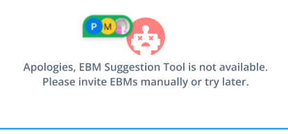
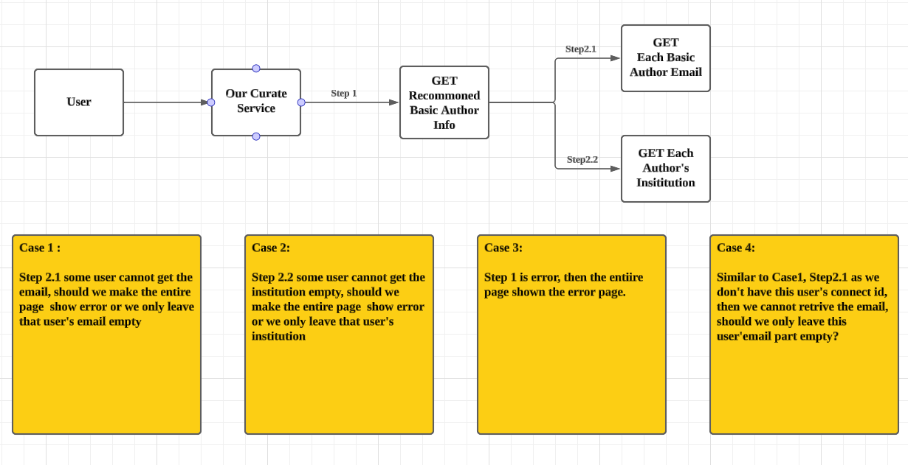

# CT-9341: EBM Review - EBM Suggestion Tool

- **Jira:** [CT-9341](https://wiley-global.atlassian.net/browse/CT-9341)
- **Type:** Story
- **Status:** Closed
- **Resolution:** Completed
- **Priority:** Critical.
- **Assignee:** Kexin Guo
- **Reporter:** Madalina Poienaru
- **Created:** 2024-10-24T06:42:29.000-0600
- **Updated:** 2026-02-13T00:20:56.572-0700
- **Labels:** FY26Q4, Phase3, SIMT
- **[CHART] Date of First Response:** 2024-10-28T20:13:51.000-0600
- **[CHART] Time in Status:** 10107_*:*_2_*:*_2048554388_*|*_10091_*:*_2_*:*_10603234401_*|*_10106_*:*_2_*:*_541088675_*|*_10093_*:*_2_*:*_944409949_*|*_6_*:*_1_*:*_20843208000_*|*_10035_*:*_2_*:*_5949734461_*|*_10125_*:*_1_*:*_0
- **Added to Manual Regression Test:** To Be Determined
- **Creator:** Madalina Poienaru
- **Delivery Portfolio and Program:** Research Publishing
- **Delivery Team:** China
- **Development:** {pullrequest={dataType=pullrequest, state=MERGED, stateCount=15}, json={"cachedValue":{"errors":[],"summary":{"pullrequest":{"overall":{"count":15,"lastUpdated":"2026-02-25T21:06:29.000-0700","stateCount":15,"state":"MERGED","dataType":"pullrequest","open":false},"byInstanceType":{"GitHub":{"count":15,"name":"GitHub"}}}}},"isStale":true}}
- **Epic Link:** CT-9021
- **Fix versions:** SIMT_v3.9.0
- **Flow Type:** Feature
- **INCIDENT Severity:** MINOR
- **Last Viewed:** 2026-04-27T02:36:04.322-0600
- **Parent:** CT-9021
- **Project:** China Technology
- **Rank:** 0|hwp52o:j00hzxi
- **Resolved:** 2026-02-13T00:17:26.303-0700
- **Sprint:** Optimus FY26Q4 - Sprint 1, SIMT FY25Q3 - Sprint 5, SIMT FY25Q3 - Sprint 6
- **Status Category:** Done
- **Status Category Changed:** 2026-02-13T00:17:26.456-0700
- **Story Points:** 5.0
- **Work Ratio:** -1
## Description

As a user with "sip:write-ops" permission, when I click on the "EBM Suggestion Tool" option, I want SIMT to initiate a call to the PKG Editor Suggestion service. 

When the "Invite EBMs" side panel opens on the "EBM Suggestion Tool" tab, there should be a "Cancel" button on the top right corner and I should be presented with a list of suitable EBMs that I can invite.

For the call to the PKG Editor Suggestion service, some documentation is available here: [Using PKG for Editor Suggestion - Phenom Publishing Platform - Wiley Global Confluence](https://wiley-global.atlassian.net/wiki/display/PPT/Using+PKG+for+Editor+Suggestion). The SIMT call will provide the SI Title, the SI Aims & Scope and the condition that the suggested users should have the "Editor" role on the "1st Choice Journal" for USIPs or " Journal Name" for SSIPs. Thus, when the PGK service returns the results, the list displayed in SIMT should only include editors associated with the target journal.

Each suggested EBM should have their data listed on a card that includes the following information: 

  * Full Name (listed as First Name Last Name)
  * ORCiD profile link (displayed as a small ORCiD icon)
  * Affiliation
  * Email Address
  * Keywords
  * Related Publications.   
When the user clicks on the Related Publication section, the card should expand further and reveal a list of relevant articles published by the EBM, including links to those articles. 

At the bottom of each EBM card, there should be an "Invite" button.

When the user clicks on "Invite", the EBM invitation email template should appear. In the top right corner, there should be two buttons:

  * A "Cancel" button. When the user clicks "Cancel", they should return to the ~~"Invite EBMs" side panel on the "EBM Suggestion Tool" tab.~~ the SIP details page
  * An "Invite" button. When the user clicks "Invite", the user will be asked to double confirm that they want to submit the invitation. When they complete the double confirm, they should return to the "Invite EBMs" side panel on the "EBM Suggestion Tool" tab and the invited EBM data should be recorded in the EBM Review Panel.

If the EBM Suggestion Tool fails either for technical reasons (network) or because key information is missing from the SIP Details, then SIMT should display an error message as shown in the Figma design.

## [CHART] Date of First Response

28/Oct/24 8:13 PM

## Acceptance Criteria

**As a** user with “sip:write-ops” permission,  
**I want** SIMT to initiate a call to the PKG Editor Suggestion service when I click on the “EBM Suggestion Tool” option,  
**So that** I can be presented with a list of suitable EBMs to invite.

**Acceptance Criteria:**

  1. **Permission Check:**
     * When the logged-in user has “sip:write-ops” permission and is assigned as the Ops Lead of an SIP in the EBM Review stage, they should be able to action/edit the EBM Review Panel.
  2. **EBM Review Panel:**
     * In the EBM Review Panel, under the table, there should be two buttons available: 
       * “EBM Suggestion Tool”
       * “Manual EBM Invitation”
  3. **Side Panel - Invite EBMs:**
     * When the user clicks on “EBM Suggestion Tool”, a side panel called “Invite EBMs” should open on the “EBM Suggestion Tool” tab.
     * The side panel should have a “Cancel” button in the top right corner.
     * The user should be presented with a list of suitable EBMs to invite.
  4. **PKG Editor Suggestion Service Call:**
     * The SIMT call to the PKG Editor Suggestion service should provide the SI Title, the SI Aims & Scope, and the condition that the suggested users should have the “Editor” role on the “1st Choice Journal” for USIPs or “Journal Name” for SSIPs.
     * The list displayed in SIMT should only include editors associated with the target journal.
  5. **EBM Cards:**
     * Each suggested EBM should have their data listed on a card that includes: 
       * Full Name (listed as First Name Last Name)
       * ORCiD profile link (displayed as a small ORCiD icon)
       * Affiliation
       * Email Address
       * Keywords
       * Related Publications
     * When the user clicks on the Related Publications section, the card should expand to reveal a list of relevant articles published by the EBM, including links to those articles.
  6. **Invite Button:**
     * At the bottom of each EBM card, there should be an “Invite” button.
     * When the user clicks on “Invite”, the EBM invitation email template should appear with two buttons in the top right corner: 
       * “Cancel”: When clicked, the user should return to the “Invite EBMs” side panel on the “EBM Suggestion Tool” tab.
       * “Invite”: When clicked, the user will be asked to double confirm the invitation. Upon confirmation, the user should return to the “Invite EBMs” side panel on the “EBM Suggestion Tool” tab, and the invited EBM data should be recorded in the EBM Review Panel.
  7. **Error Handling:**
     * If the EBM Suggestion Tool fails due to technical reasons (network) or missing key information from the SIP Details, SIMT should display an error message as shown in the Figma design.

## Created

24/Oct/24 6:42 AM

## Last Comment

[Kexin Guo](https://wiley-global.atlassian.net/secure/ViewProfile.jspa?accountId=712020%3Ae871d105-509e-4a66-b43c-79f64426ae19) confirming responses here:

  1. show error message from case 3
  2. show user without institute
  3. show error message, without icon
  4. exclude this user

## Last Viewed

Today 2:36 AM

## Resolved

13/Feb/26 12:17 AM

## Status Category Changed

13/Feb/26 12:17 AM

## Updated

13/Feb/26 12:20 AM

## Attachments

- [image-2024-12-20-09-33-17-541.png](https://wiley-global.atlassian.net/rest/api/3/attachment/content/366574) Kexin Guo — 2024-12-19T18:33:22.000-0700 — 200057 bytes — image/png
- [image-2024-12-20-09-33-34-227.png](https://wiley-global.atlassian.net/rest/api/3/attachment/content/366576) Kexin Guo — 2024-12-19T18:33:38.000-0700 — 66705 bytes — image/png
- [image-2024-12-20-09-33-51-695.png](https://wiley-global.atlassian.net/rest/api/3/attachment/content/366577) Kexin Guo — 2024-12-19T18:33:56.000-0700 — 409138 bytes — image/png
- [image-20260202-071418.png](https://wiley-global.atlassian.net/rest/api/3/attachment/content/1239488) Kexin Guo — 2026-02-02T00:16:49.838-0700 — 17268 bytes — image/png
- [image-20260203-090041.png](https://wiley-global.atlassian.net/rest/api/3/attachment/content/1240360) Kexin Guo — 2026-02-03T02:01:16.378-0700 — 94868 bytes — image/png

## Subtasks

- [CT-10095](https://wiley-global.atlassian.net/browse/CT-10095) Case Execution (Sub-task — Done)
- [CT-10096](https://wiley-global.atlassian.net/browse/CT-10096) Case Review (Sub-task — Done)
- [CT-10071](https://wiley-global.atlassian.net/browse/CT-10071) Design (Sub-task — Done)
- [CT-10072](https://wiley-global.atlassian.net/browse/CT-10072) BE-work (Sub-task — Done)
- [CT-10094](https://wiley-global.atlassian.net/browse/CT-10094) Case Design (Sub-task — Done)
- [CT-10073](https://wiley-global.atlassian.net/browse/CT-10073) FE-work (Sub-task — Done)
- [CT-10101](https://wiley-global.atlassian.net/browse/CT-10101) UT (Sub-task — Done)
- [CT-10291](https://wiley-global.atlassian.net/browse/CT-10291) Hide for the ebm sugesttion tool (Sub-task — Done)
- [CT-13348](https://wiley-global.atlassian.net/browse/CT-13348) FE-work-enable-EBM-suggest tool (Sub-task — Done)
- [CT-13349](https://wiley-global.atlassian.net/browse/CT-13349) BE-work (Sub-task — Done)
- [CT-13350](https://wiley-global.atlassian.net/browse/CT-13350) Config connect secret in aws manager (Sub-task — Done)
- [CT-13351](https://wiley-global.atlassian.net/browse/CT-13351) integrate-test (Sub-task — Done)
- [CT-13352](https://wiley-global.atlassian.net/browse/CT-13352) Design (Sub-task — Done)
- [CT-13363](https://wiley-global.atlassian.net/browse/CT-13363) Set up the mock data when query the recommend ebm in non-prod env. (Sub-task — Done)
- [CT-13387](https://wiley-global.atlassian.net/browse/CT-13387) Case Design (Sub-task — Done)
- [CT-13388](https://wiley-global.atlassian.net/browse/CT-13388) Case Review (Sub-task — Done)
- [CT-13389](https://wiley-global.atlassian.net/browse/CT-13389) Case Execution (Sub-task — Done)

## Linked work items

- **associated with** [CT-10185](https://wiley-global.atlassian.net/browse/CT-10185) — [Sprint5]The total numbers of suggested EBMs should be displayed next to the tab
- **associated with** [CT-10187](https://wiley-global.atlassian.net/browse/CT-10187) — [Sprint5]After the user clicks "Cancel", they should return to the "Invite EBMs" side panel on the "EBM Suggestion Tool" tab
- **is blocked by** [CT-10349](https://wiley-global.atlassian.net/browse/CT-10349) — Solution for EBM Suggestion Tool surfacing emails
- **associated with** [CT-13414](https://wiley-global.atlassian.net/browse/CT-13414) — [Sprint1]If the user is disabled in Connect, he/she should not be displayed in list
- **associated with** [CT-13408](https://wiley-global.atlassian.net/browse/CT-13408) — [Sprint1]Failed to invite EBM Reviewer
- **associated with** [CT-13403](https://wiley-global.atlassian.net/browse/CT-13403) — [Sprint1]It should return to the “Invite EBMs” side panel on the “EBM Suggestion Tool” tab after clicking Cancel button in email template
- **associated with** [CT-13402](https://wiley-global.atlassian.net/browse/CT-13402) — [Sprint1]The format of EBM Reviewer's name should be First Name Last Name

## Comments

**Yitong Han** · 2024-10-28T20:13:51.000-0600  [Jira](https://wiley-global.atlassian.net/browse/CT-9341?focusedCommentId=1159890)

View the more interaction description in design file, if you have any question, please leave comments next to the design. 

figma link : [https://www.figma.com/design/Us5VG3TEeXgwxxqeanDUoI/SIMT-Phase-3-Q2?node-id=862-2150&t=vXEwg81Zhb1UC8R5-1](https://www.figma.com/design/Us5VG3TEeXgwxxqeanDUoI/SIMT-Phase-3-Q2?node-id=862-2150&t=vXEwg81Zhb1UC8R5-1)

**Eshani Werapitiya** · 2024-12-17T23:58:22.000-0700  [Jira](https://wiley-global.atlassian.net/browse/CT-9341?focusedCommentId=1159891)

**As a** user with “sip:write-ops” permission,
**I want** SIMT to initiate a call to the PKG Editor Suggestion service when I click on the “EBM Suggestion Tool” option,
**So that** I can be presented with a list of suitable EBMs to invite.

**Acceptance Criteria:**

- **Permission Check:**

- 

  - When the logged-in user has “sip:write-ops” permission and is assigned as the Ops Lead of an SIP in the EBM Review stage, they should be able to action/edit the EBM Review Panel.

- **EBM Review Panel:**

- 

  - In the EBM Review Panel, under the table, there should be two buttons available:

    - “EBM Suggestion Tool”

    - “Manual EBM Invitation”

- **Side Panel - Invite EBMs:**

- 

  - When the user clicks on “EBM Suggestion Tool”, a side panel called “Invite EBMs” should open on the “EBM Suggestion Tool” tab.

  - The side panel should have a “Cancel” button in the top right corner.

  - The user should be presented with a list of suitable EBMs to invite.

- **PKG Editor Suggestion Service Call:**

- 

  - The SIMT call to the PKG Editor Suggestion service should provide the SI Title, the SI Aims & Scope, and the condition that the suggested users should have the “Editor” role on the “1st Choice Journal” for USIPs or “Journal Name” for SSIPs.

  - The list displayed in SIMT should only include editors associated with the target journal.

- **EBM Cards:**

- 

  - Each suggested EBM should have their data listed on a card that includes:

    - Full Name (listed as First Name Last Name)

    - ORCiD profile link (displayed as a small ORCiD icon)

    - Affiliation

    - Email Address

    - Keywords

    - Related Publications

  - When the user clicks on the Related Publications section, the card should expand to reveal a list of relevant articles published by the EBM, including links to those articles.

- **Invite Button:**

- 

  - At the bottom of each EBM card, there should be an “Invite” button.

  - When the user clicks on “Invite”, the EBM invitation email template should appear with two buttons in the top right corner:

    - “Cancel”: When clicked, the user should return to the “Invite EBMs” side panel on the “EBM Suggestion Tool” tab.

    - “Invite”: When clicked, the user will be asked to double confirm the invitation. Upon confirmation, the user should return to the “Invite EBMs” side panel on the “EBM Suggestion Tool” tab, and the invited EBM data should be recorded in the EBM Review Panel.

- **Error Handling:**

- 

  - If the EBM Suggestion Tool fails due to technical reasons (network) or missing key information from the SIP Details, SIMT should display an error message as shown in the Figma design.

**Kexin Guo** · 2024-12-19T18:34:05.000-0700  [Jira](https://wiley-global.atlassian.net/browse/CT-9341?focusedCommentId=1159892)

- Shall we directly use prod api in non prod env?

- Should we use this API /suggest/pub2author/search?

- The domain contains the stag, is staging env and prod env different?

[https://pkg-entity-recommendation.atypon.com/swagger-ui/index.html?configUrl=/v3/api-docs/swagger-config#/pub-2-author-controller/getAuthorRecommendationsForText](https://pkg-entity-recommendation.atypon.com/swagger-ui/index.html?configUrl=/v3/api-docs/swagger-config#/pub-2-author-controller/getAuthorRecommendationsForText)

- Should we add the pool? Like <Journal> Editor>?

Shall we get the user email from pkg? If so , how should we get  it?

Should we through this API ? : [https://pkg-dashboard.atypon.com/author/{authorId}](https://pkg-dashboard.atypon.com/author/%7bauthorId%7d) Do we have any other API to retrive data?Do we support batch search?   

**Block: Where is the email located, how should we get it.**

- Is Keywords means the `Top Fields of Study`?

- Is Affiliation same as the institutions?

@@Madalina Poienaru

cc @@Zhiyuan Gao

**Kexin Guo** · 2024-12-30T20:35:07.000-0700  [Jira](https://wiley-global.atlassian.net/browse/CT-9341?focusedCommentId=1159893)

Currently temporary solution (which might need to move to next sprint):
1. skip the affiliation and keywords

2. mock the email with mailinator email address by using the username from the API.

**Chris Mavergames** · 2025-01-09T05:56:03.000-0700  [Jira](https://wiley-global.atlassian.net/browse/CT-9341?focusedCommentId=1159894)

PKG does not have email addresses.

**Madalina Poienaru** · 2025-01-09T06:14:13.000-0700  [Jira](https://wiley-global.atlassian.net/browse/CT-9341?focusedCommentId=1159895)

Hi @@Chris Mavergames. When the Editor Suggestion tools is used in ReX Review is the email address not displayed to the user? If it is, then where does it come from?

For SIMT to be able to send out invitations to editor to review SI proposal details an email address would be required.

**Chris Mavergames** · 2025-01-09T07:55:47.000-0700  [Jira](https://wiley-global.atlassian.net/browse/CT-9341?focusedCommentId=1159896)

It's migrated from Snowflake and or is already in the Hindawi database.

**Isabella Chan** · 2025-01-13T04:54:22.000-0700  [Jira](https://wiley-global.atlassian.net/browse/CT-9341?focusedCommentId=1159897)

In the weekly call, we discussed the following:

- One of the key questions is if SIMT already has the Op-in to send emails to those editors.

- It is suggested to talk to ReX review further if/how they use the CONNECT ID to look up the email addresses.

- There might be other possible solutions too.

- Time might be challenging to complete this in Q3, possibly postpone till Q4 for further discussion.

 

@@Zhiyuan Gao to discuss with @@Madalina Poienaru further.

**Kexin Guo** · 2026-01-22T20:16:16.052-0700  [Jira](https://wiley-global.atlassian.net/browse/CT-9341?focusedCommentId=3545959)

All the block issue is resolved, We can plan and start working on it.

For this develop, we will checkout from the main branch so that we can have a delicate release for it.

**Kexin Guo** · 2026-01-26T02:20:24.844-0700  [Jira](https://wiley-global.atlassian.net/browse/CT-9341?focusedCommentId=3547283)

It will release before multi tenancy, we need checkout from main branch and make the UAT session ASAP.

**Kexin Guo** · 2026-01-28T02:32:09.402-0700  [Jira](https://wiley-global.atlassian.net/browse/CT-9341?focusedCommentId=3549794)

@@Aradhana Mistry  For testing , currently  the pkg staging env returned the data with prod connect id, can u help check with review  team that how do they test this feature? Thanks!
> **↳** **Kexin Guo** · 2026-02-03T02:03:03.043-0700  [Jira](https://wiley-global.atlassian.net/browse/CT-9341?focusedCommentId=3555045)
> 
> @@Kexin Guo This has been resolved. We will using the prod connect API in non-prod env to retrive user info.

**Kexin Guo** · 2026-02-02T00:16:50.453-0700  [Jira](https://wiley-global.atlassian.net/browse/CT-9341?focusedCommentId=3553444)

@@Aradhana Mistry  Hi , There have some edge case need your input.

**Case 1: **, if the CONNECT API didn’t response, this user’s email will be empty, should we don’t allow the user to invite this ebm? If user refresh this page, the email maybe back.

**Case 2 **: If the graphQL response empty, the user’s institution may be empty, it will not blocker user invite flow. Do we need handle this? 

**Case 3:** If the Pkg recommend author API return empty, the FE will be like this  

 Is that accpetable?

**Case 4:  **Very rare cases, if the user really have no connect ID in the pkg side, the email of this user will be empty, we cannot invite this user either as his email is empty, is that acceptable?
> **↳** **Kexin Guo** · 2026-02-03T02:01:17.063-0700  [Jira](https://wiley-global.atlassian.net/browse/CT-9341?focusedCommentId=3555039)
> 
> @@Kexin Guo 
> 
> 
> 
> @@Aradhana Mistry I have drawn a diagram, hope u can understand my question.
> **↳** **Aradhana Mistry** · 2026-02-03T03:26:47.274-0700  [Jira](https://wiley-global.atlassian.net/browse/CT-9341?focusedCommentId=3555149)
> 
> @@Kexin Guo confirming responses here:
> 
> - show error message from case 3
> 
> - show user without institute
> 
> - show error message, without icon
> 
> - exclude this user
